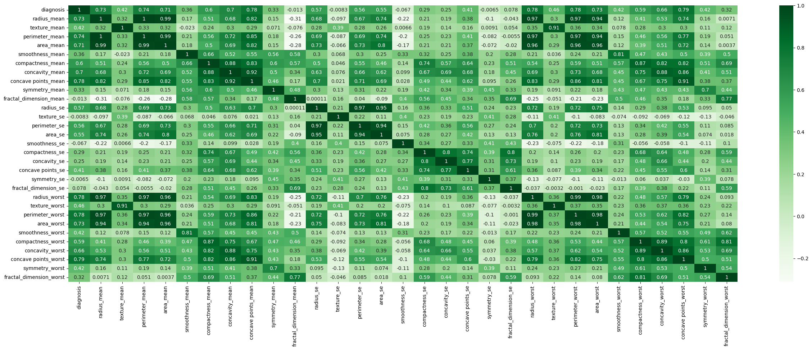

# classifier_model_evaluation

This is a simple evaluation of performances of different classification models tested on the standard __Breast Cancer Wisconsin (Diagnostic) Data Set__ to predict whether the cancer is __*Benign*__ or __*Malignant*__.

The features are computed from a digitized image of a Fine Needle Aspirate (FNA) of a breast mass. They describe characteristics of the cell nuclei present in the image.

This is a standard dataset is generated that provides __30 characteristic__ features of the cells present in different patients with their respective diagnosis.

The program attempts to run different classification models on the dataset to see the varying performances against each other.

The data is initially cleaned, transformed and scaled before training the models. The correlation matrix for is also generated.

### **Environment** 
Python 3.6 or above

### Run
    
Download all the dependencies.
    
    pip install -r requirements.txt

Run the classifier.

    python classifier.py

 
